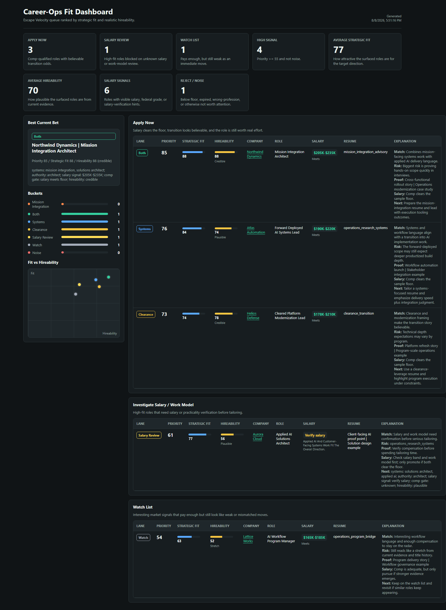

# Career-Ops

> Personalized role-discovery and triage system for selective job search workflows.
>
> Upstream project: [career-ops by Santiago Fernández de Valderrama](https://github.com/santifer/career-ops)


Default branch: `main`

## Overview

This fork keeps the upstream `career-ops` tooling focused on a practical loop:

1. Scan direct company boards and selected sources for relevant roles
2. Deduplicate and append new matches into a pipeline
3. Classify roles by strategic fit, hireability, and compensation viability
4. Render a dashboard for quick human review

The intended workflow is human-in-the-loop. This repo helps discover, rank, and prepare opportunities; it does not auto-submit applications by default.

## Upstream And Fork

- Upstream project: [`santifer/career-ops`](https://github.com/santifer/career-ops)
- This repository: a fork with additional scanner, classifier, dashboard, and workflow customization

## Included Sample Data

The tracked sample files in [`data/`](./data/) and [`dashboard/fit-dashboard.html`](./dashboard/fit-dashboard.html) are **synthetic**. They are included only to demonstrate the workflow and UI shape without publishing a real candidate pipeline or scan history.

## Main Workflow

### 1. Scan company boards

```bash
npm run scan:boards
```

This runs [`scan-company-boards.mjs`](./scan-company-boards.mjs) and:

- reads local search configuration from [`portals.yml`](./portals.yml)
- scans supported ATS/company boards directly
- applies title and location filters
- deduplicates against prior pipeline and history data
- appends new matches to [`data/pipeline.md`](./data/pipeline.md)

### 2. Classify candidates

```bash
npm run classify:top
```

This runs [`classify-candidates.mjs`](./classify-candidates.mjs) and:

- reads pending roles from the pipeline
- scores strategic fit, hireability, and blended priority
- tags roles into buckets like `both`, `systems-escape-velocity`, `clearance-leverage`, `salary_unknown_review`, `watch`, and `noise`
- writes ranked output to [`data/candidate-classifications.tsv`](./data/candidate-classifications.tsv)

### 3. Build the fit dashboard

```bash
npm run dashboard:fit
```

This runs [`generate-fit-dashboard.mjs`](./generate-fit-dashboard.mjs) and writes the current static review dashboard to [`dashboard/fit-dashboard.html`](./dashboard/fit-dashboard.html).

## Dashboard Screenshot



## Quick Start

```bash
git clone https://github.com/Oracle1267/Career-Ops.git
cd career-ops
git switch main
npm install
npx playwright install chromium
```

Then make sure these local files exist and reflect your actual search:

- [`config/profile.yml`](./config/profile.yml)
- [`portals.yml`](./portals.yml)
- [`data/pipeline.md`](./data/pipeline.md)

Run the active workflow:

```bash
npm run scan:boards
npm run classify:top
npm run dashboard:fit
```

Open the generated dashboard:

- [`dashboard/fit-dashboard.html`](./dashboard/fit-dashboard.html)

## Source Of Truth Files

[`config/profile.yml`](./config/profile.yml)
- Candidate-specific targets, narrative, compensation floor, and constraints

[`portals.yml`](./portals.yml)
- Tracked companies, title filters, location filters, and search-source settings

[`data/pipeline.md`](./data/pipeline.md)
- Pending or discovered role queue

[`data/scan-history.tsv`](./data/scan-history.tsv)
- Scanner memory and dedupe history

[`data/candidate-classifications.tsv`](./data/candidate-classifications.tsv)
- Ranked triage output

[`dashboard/fit-dashboard.html`](./dashboard/fit-dashboard.html)
- Static review dashboard

[`state.md`](./state.md)
- Public handoff describing the repo’s current workflow layers

## Project Structure

```text
career-ops/
├── config/                      # Candidate-specific scoring and targeting config
├── data/                        # Sample pipeline, history inputs, and classifications
├── dashboard/                   # Static fit dashboard + Go TUI code
├── docs/                        # Scanner, classifier, and architecture docs
├── scan-company-boards.mjs      # Direct board scanner
├── classify-candidates.mjs      # Deterministic role classifier
├── generate-fit-dashboard.mjs   # Static HTML dashboard generator
├── portals.yml                  # Local tracked-company universe
└── state.md                     # Public implementation summary
```

## Documentation

- [`docs/COMPANY_BOARD_SCANNER.md`](./docs/COMPANY_BOARD_SCANNER.md)
- [`docs/CANDIDATE_CLASSIFIER.md`](./docs/CANDIDATE_CLASSIFIER.md)
- [`docs/ARCHITECTURE.md`](./docs/ARCHITECTURE.md)
- [`state.md`](./state.md)

## License

MIT
